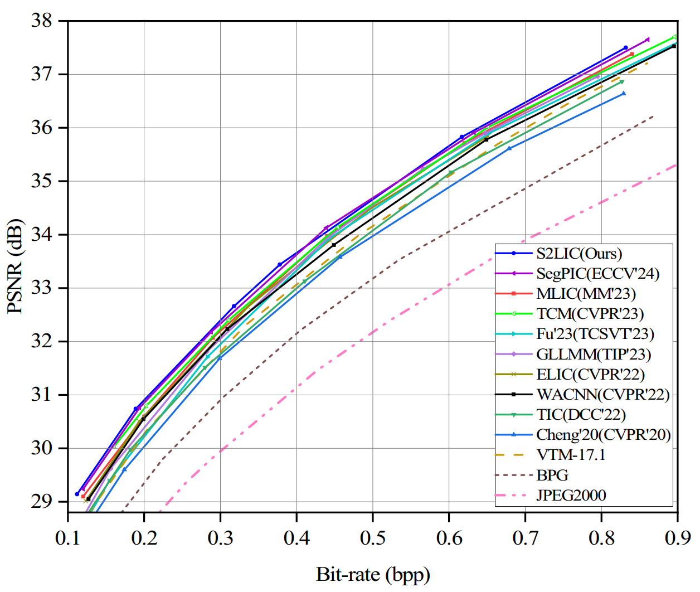

# S2LIC: Learned Image Compression with the SwinV2 Block, Adaptive Channel-wise and Global-inter Attention Context

[**📄 Paper on arXiv**] 
[](https://arxiv.org/abs/2403.14471)
---

## 🧠 Architectures

### Overall Framework


### Proposed Entropy Model


---

## 📊 Evaluation Results

### RD Curves on Kodak


### Visual Quality Comparisons


---

## 📄 Citation

If you find our project useful, please cite:

```bibtex
@article{wang2024s2lic,
  title={S2LIC: Learned Image Compression with the SwinV2 Block, Adaptive Channel-wise and Global-inter Attention Context},
  author={Wang, Yongqiang and Liang, Feng and Liang, Jie and Fu, Haisheng},
  journal={arXiv preprint arXiv:2403.14471},
  year={2024}
}
```
---
## 🙏 Acknowledgement
This work is built on top of the following projects:

[CompressAI](https://github.com/InterDigitalInc/CompressAI)

[MLIC](https://github.com/JiangWeibeta/MLIC)

[TIC](https://github.com/lumingzzz/TIC)

We thank the authors for sharing their excellent work.


