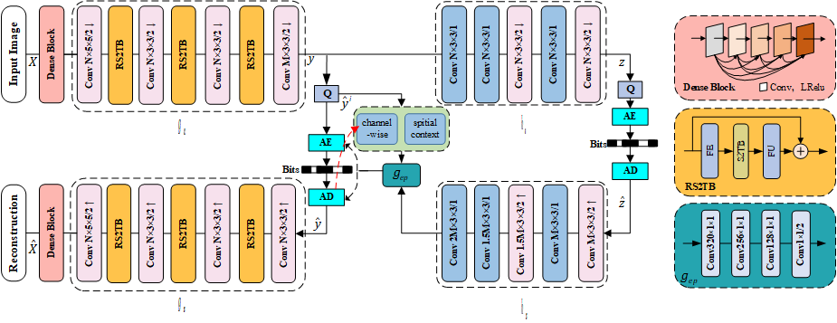
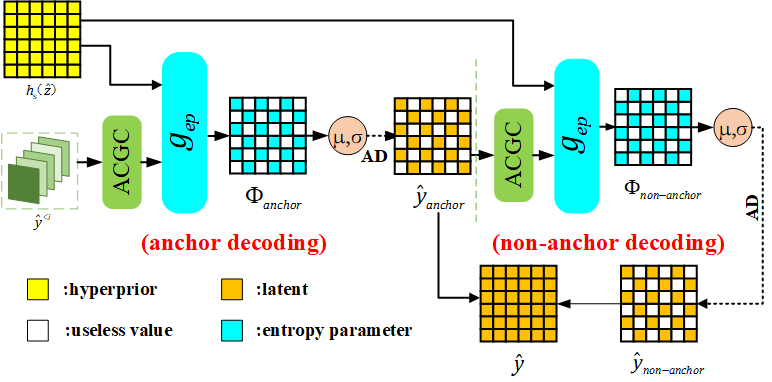
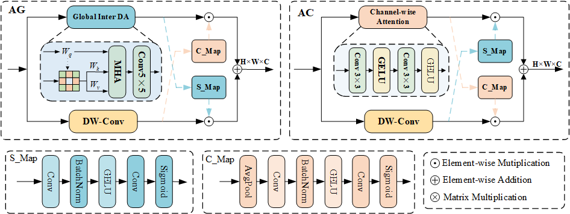
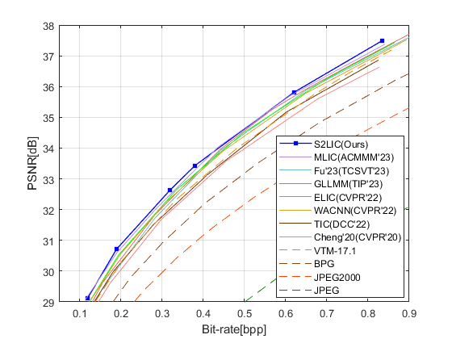
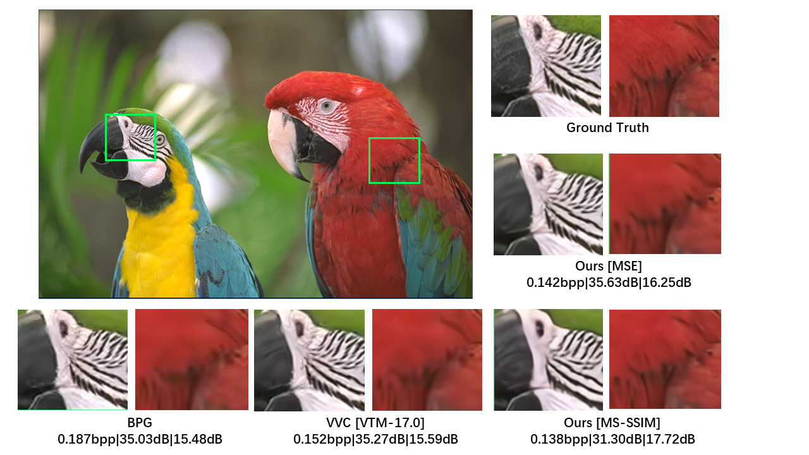

*S2LIC: Learned Image Compression with the SwinV2 Block, Adaptive Channel-wise and Global-inter Attention ContextMulti-Reference Entropy Model for Learned Image Compression* [[Arxiv](https://arxiv.org/abs/2403.14471)]

## Architectures
The overall framework.

The proposed entropy model.

## Evaluation Results
RD curves on Kodak.

visual.

## Ackownledgement
Our work is based on the framework of [CompressAI](https://github.com/InterDigitalInc/CompressAI). The base codec is adopted from [MLIC](https://github.com/JiangWeibeta/MLIC)/[TIC](https://github.com/lumingzzz/TIC). We thank the authors for open-sourcing their code.