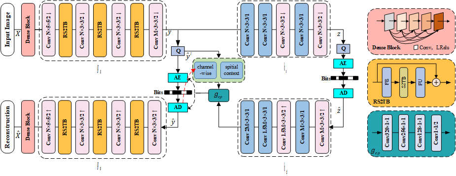
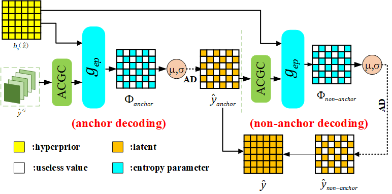
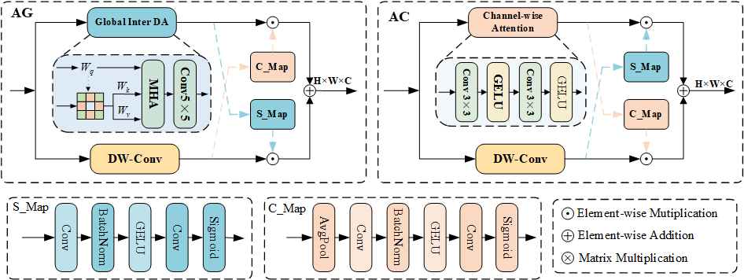
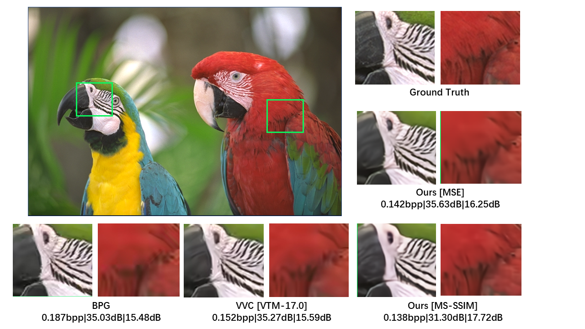

# S2LIC: Learned Image Compression with the SwinV2 Block, Adaptive Channel-wise and Global-inter Attention Context

## 🧠 Architectures

### Overall Framework

### Proposed Entropy Model

---

## 📊 Visual Quality Comparisons

---

## 🙏 Acknowledgement
This work is built on top of the following projects:

[CompressAI](https://github.com/InterDigitalInc/CompressAI)

[MLIC](https://github.com/JiangWeibeta/MLIC)

[TIC](https://github.com/lumingzzz/TIC)

We thank the authors for sharing their excellent work.

